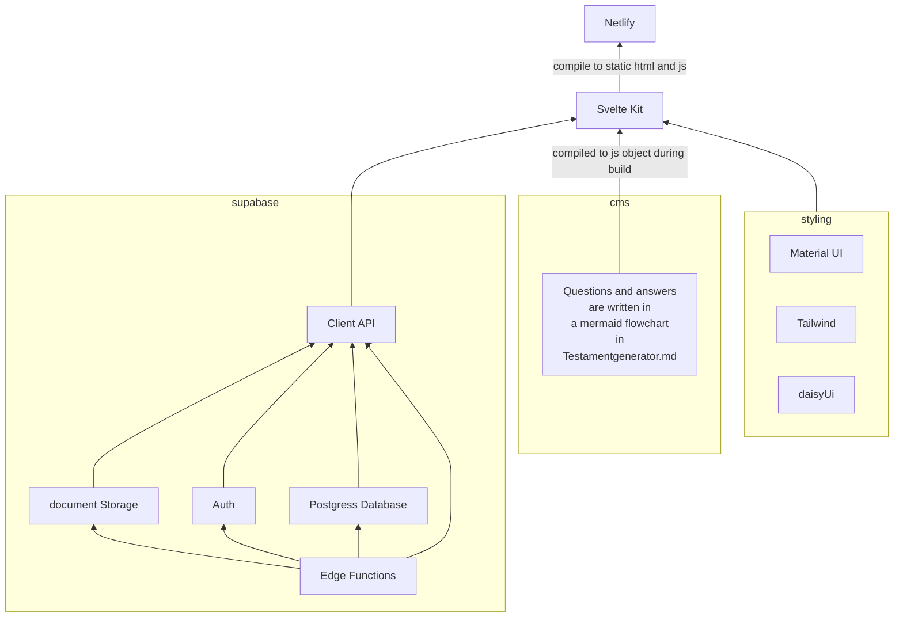
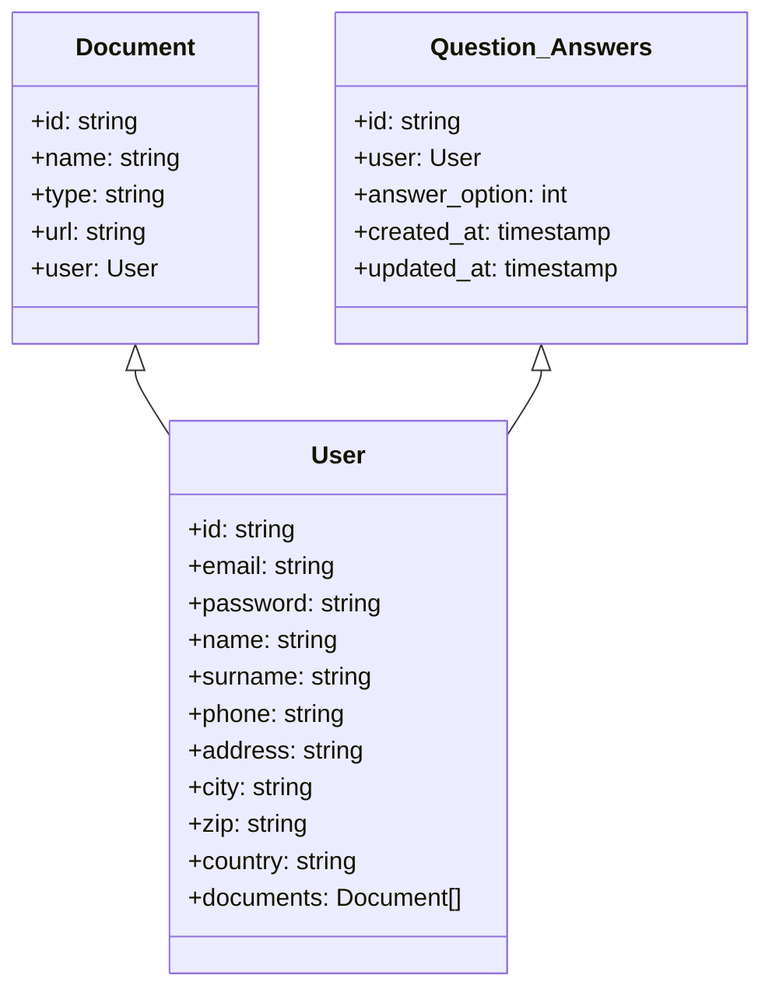

# MeinNachlass.com WebApp
Web app for our MeinNachlass.com Service

Landingpage: [www.MeinNachlass.com](www.MeinNachlass.com)   
WebApp: [app.Meinnachlass.com](app.Meinnachlass.com)  
[](https://app.netlify.com/sites/service-beyond/deploys)

I have solo developed this WebApp including frontend and backend.  
I made the CSS and style of this website according to a proto.io prototype.  
This website is built with svelte-kit and Supabase in a JAM-stack configuration.  
The Sveltekit Frontend is compiled into a static website hosted on Netlify (CDN).  
Supabase is a Backend as a service based on a Postgres DB.  
Supabase is used for all Database stuff, Authentication and Authorisation and as a blob storage for PDFs.  
I use a single aws lambda function for generating PDFs from markdown.  
Check out the infrastructure diagram in the [infrastructure diagram](#infrastructure-diagram-id).  

Thanks to the simplicity of the architecture and the power of my hosting providers Netlify and Supabase,  
My web app has the full DevOps workflow with continuous deployment built right in. If I create a pull request to main, a staging site is automatically deployed and online available for review.

Another really cool Thing about this webapp is how I have done my CMS for storing and configuring the questions
and answers for my questionaire. My CMS is basically a markdown file versioned through this git repository.
[My Markdown file](./app\src\lib\Testamentgenerator_qusetions.md) has one code block with a mermaid tag. 
mermaid is a cool extension, that can render flowcharts and everything. (I have also used this tool to make the architecture graph in this README).
I use the flowchart syntax of mermaid, to represent my questionnaire.
I use my one extra syntax in the comments of the flowchart to encode extra information.
The transitions of the questions are represented in the regular mermaid syntax.  
With the mermaid extension in VsCode, this flowchart is automatically rendered as a graph.
This allows me to edit the flow of my questionnaire in a simple process with quick feedback.  
This looks like the following:
```
    flowchart TD;
        %%Template
    %%Questions
    __00100(verheiratet?)
        %%typ 'regular'
        %%frage 'Wie ist Ihr Familienstand?'
        %%option0 'Verheiratet'
        %%option1 'Nicht (mehr) verheiratet'
        %%info 'Hier ist Ihr offizieller Familienstand maßgeblich. Das bedeutet, dass selbst wenn Sie in fester Partnerschaft leben, nur eine Ehe oder eingetragene Lebenspartnerschaft für Ihr Testament entscheidend sind. (ninebarc)'

    %%Transitions
    __00100--ja-->__00110
    __00100--nein-->__00200
    __00110--gemeinsam-->__00120
    __00110--alleine-->__00200
```
In the file [questionnaire.ts](./app\src\lib\questionnaire.ts), I have created a compiler for this syntax.
It compiles the questions to a javascript object.
The exported function get_questions() then returns the data and flow of the questionnaire into a questions and transitions array. 
```js
export function get_questions(): {
    questions: questions_dict;
    transitions: transitions_network;
}
```

- [MeinNachlass.com WebApp](#meinnachlasscom-webapp)
  - [Installation](#installation)
    - [docker + aws cli for development of supabase edge functions and aws lambda functions](#docker--aws-cli-for-development-of-supabase-edge-functions-and-aws-lambda-functions)
    - [VS Code extensions](#vs-code-extensions)
  - [Usage](#usage)
    - [How to do Icons](#how-to-do-icons)
    - [setup supabase](#setup-supabase)
    - [generate typescript types for supabase](#generate-typescript-types-for-supabase)
    - [supabase edge functions](#supabase-edge-functions)
  - [run the Deno: Initialize Workspace Configuration command.](#run-the-deno-initialize-workspace-configuration-command)
      - [usage](#usage-1)
    - [material UI colors](#material-ui-colors)
  - [Architecture](#architecture)
    - [initial architecture idea](#initial-architecture-idea)
    - [infrastructure diagram    {infrastructure-diagram-id}](#infrastructure-diagram----infrastructure-diagram-id)
  - [Database structure](#database-structure)
    - [What Views should my database generate?](#what-views-should-my-database-generate)
    - [netlify](#netlify)
    - [sveltekit](#sveltekit)
    - [copilot is actually pretty good](#copilot-is-actually-pretty-good)
- [development Journey](#development-journey)
  - [install sveltekit](#install-sveltekit)
  - [setup static adapter](#setup-static-adapter)
  - [deploy with netlify](#deploy-with-netlify)
  - [setup git LFS](#setup-git-lfs)
    - [error when deploying](#error-when-deploying)
  - [try out reusable components and routing](#try-out-reusable-components-and-routing)
  - [check out UI Framworks](#check-out-ui-framworks)
  - [link our custom domain](#link-our-custom-domain)
  - [Evaluate UI Library](#evaluate-ui-library)
  - [Trello Aufgaben überlegen](#trello-aufgaben-überlegen)
  - [https://svelte.dev/tutorial/basics](#httpssveltedevtutorialbasics)
  - [migrate Sveltekit](#migrate-sveltekit)
  - [setup SMUI](#setup-smui)
    - [Learn SCSS and SASS](#learn-scss-and-sass)
    - [figure out and setup icons](#figure-out-and-setup-icons)
    - [scss thing was not working](#scss-thing-was-not-working)
  - [setup tailwind](#setup-tailwind)
  - [reset css styles](#reset-css-styles)
  - [stupid links are draggable and mess with dem being abel to be clicked.](#stupid-links-are-draggable-and-mess-with-dem-being-abel-to-be-clicked)
  - [make the footer stick to bottom](#make-the-footer-stick-to-bottom)
  - [try out the official tailwind installation, to fix bug](#try-out-the-official-tailwind-installation-to-fix-bug)
  - [check out supabase ui](#check-out-supabase-ui)
  - [do auth based on the supabase-js documentation](#do-auth-based-on-the-supabase-js-documentation)
  - [connect supabase with my email server (mail.zoho.eu)](#connect-supabase-with-my-email-server-mailzohoeu)
  - [stupid problem with supabase auth.](#stupid-problem-with-supabase-auth)
  - [setup protected route with svelte await blocks](#setup-protected-route-with-svelte-await-blocks)
  - [implement static optimized tailwind for production](#implement-static-optimized-tailwind-for-production)
  - [make the password field have the correct type and have hidden characters](#make-the-password-field-have-the-correct-type-and-have-hidden-characters)
  - [Create the Questionaire from a Human Readable and editable flow chart](#create-the-questionaire-from-a-human-readable-and-editable-flow-chart)
    - [Requirements for storage](#requirements-for-storage)
    - [Create a Questionaire from the data](#create-a-questionaire-from-the-data)
  - [Generate a Pdf from the data of the questionaire](#generate-a-pdf-from-the-data-of-the-questionaire)
    - [What do I need to create the pdf](#what-do-i-need-to-create-the-pdf)
      - [ways to create a pdf in a deno function](#ways-to-create-a-pdf-in-a-deno-function)
    - [I can not do it in deno on the edge](#i-can-not-do-it-in-deno-on-the-edge)
    - [lambda function to convert markdown to pdf](#lambda-function-to-convert-markdown-to-pdf)
    - [supabase edge functions](#supabase-edge-functions-1)
      - [write to storage (from cloud function)](#write-to-storage-from-cloud-function)
  - [Build a family tree](#build-a-family-tree)
    - [Find the correct library](#find-the-correct-library)
    - [YFIles / YWorks](#yfiles--yworks)
  - [How to do testing in sveltekit](#how-to-do-testing-in-sveltekit)
    - [Problem:](#problem)
  - [Vitest is amazing](#vitest-is-amazing)
  - [development of aws lambda function for generating pdf testamant from markdown](#development-of-aws-lambda-function-for-generating-pdf-testamant-from-markdown)
    - [can I use local file system with aws lambda](#can-i-use-local-file-system-with-aws-lambda)
    - [plan:](#plan)
    - [How to make the edge function secure?](#how-to-make-the-edge-function-secure)
    - [Using a random secret key seems like the best option, because it is the easiest to implement.](#using-a-random-secret-key-seems-like-the-best-option-because-it-is-the-easiest-to-implement)
    - [env variable in supabase edge function](#env-variable-in-supabase-edge-function)


## Installation
I use git-lfs for large binary files like images and other media  
install https://git-lfs.github.com/  

install dependencies and run the dev-server for the svelte-kit frontend
```bash
cd app  
npm install  
npx smui-theme template src/theme
npm run prepare
npm run dev -- --open
```
create your theme files with smui-theme > `npx smui-theme template src/theme`  
Whenever you add a new SMUI package, run > `npm run prepare` again to rebuild your CSS file with the new component’s styles included.

### docker + aws cli for development of supabase edge functions and aws lambda functions
I use docker only for my aws lambda function to 
https://docs.aws.amazon.com/cli/latest/userguide/getting-started-install.html

https://docs.docker.com/get-docker/

### VS Code extensions
These extensions are necessary
- German - Code Spell Checker
- HTML CSS Support
- Svelte for VS Code
- Svelte 3 Snippets
- Tailwind CSS IntelliSense
- Markdown Preview Mermaid Support
- Mermaid Markdown Syntax Highlighting
- deno
- github copilot
- Node.js Notebooks (REPL)
- Material Icon Theme


## Usage

### How to do Icons
choose icon from here https://materialdesignicons.com/  
and import it in the script as follows   
`import { mdiMenu } from '@mdi/js';`  
`import { Svg } from '@smui/common/elements';`  
`import { Icon } from '@smui/common';`
and then:
```html
<Icon component={Svg} viewBox="0 0 24 24" width="20px" height="20px">
    <path fill="currentColor" d={mdiMenu} />
</Icon>
```
or download svg from here https://www.svgrepo.com/svg/485460/right-2
### setup supabase
https://supabase.com/docs/guides/cli  

first you may need to install scoop
it is a command line installer for windows
https://scoop.sh/
```sh	
irm get.scoop.sh | iex
```
then install supabase

```
scoop bucket add supabase https://github.com/supabase/scoop-bucket.git
scoop install supabase
``` 
then you have to link your cli to your supabase project
```sh
supabase link --project-ref cpoebtwwvzcrewfytfad --password here-is-your-database-password
```
maybe also login to supabase with your cli token
```sh
supabase login
```

### generate typescript types for supabase
```sh
supabase gen types typescript --linked --schema public > supabase/types/supabase.ts
```
or
```sh
supabase gen types typescript --linked --schema public > app/src/lib/database.types.ts
```
### supabase edge functions
For this to work some stuff needs to be installed and set up:
- Docker  
 https://www.docker.com/products/docker-desktop/
- deno (language server) 
 https://deno.land/#installation
- setup deno extension in vs code  
 run the Deno: Initialize Workspace Configuration command.
- 

#### usage
```sh
supabase functions -h
```
- delete- >      Delete a Function from Supabase  
- deploy ->      Deploy a Function to Supabase  
- new    ->      Create a new Function locally  
- serve  ->      Serve a Function locally  
```sh
supabase start
```

to start the local supabase docker server
### material UI colors
need to be set in src/variables.scss and src/theme/_smui-theme.scss

## Architecture
### initial architecture idea

Actually, for now, we don't need any external data storage notion CMS is replaced by a mermaid flowchart in the markdown file

### infrastructure diagram    {infrastructure-diagram-id}

if no diagram is shown, please install the mermaid extension for vs code



## Database structure
*if no diagram is shown, please install the mermaid extension for vs code*


### What Views should my database generate?

answers of a User

| question_id | answer_option |
|----|---------|
|q-id|0|
|q-id|1|
|q-id|0|
|q-id|null|

### netlify
hosts static files (js, html, css, images, media)

### sveltekit
Startet with the SvelteKit demo app (simple ToDo app)  
Typescript - Yes
ESLint - Yes
Prettier - Yes
Playwright - Yes


### copilot is actually pretty good


# development Journey

## install sveltekit
---
https://kit.svelte.dev/  
Started with the SvelteKit demo app (simple ToDo app)  
Typescript - Yes
ESLint - Yes
Prettier - Yes
Playwright - Yes

## setup static adapter
---
https://github.com/sveltejs/kit/tree/master/packages/adapter-static  
npm i -D @sveltejs/adapter-static  

## deploy with netlify
---
very easy 
just specify the base dir as "app/"  
thats it....
build time for the sceleton app with routes and an image.  __Build time:__ 16s

## setup git LFS
---
https://git-lfs.github.com/  

I found out, that it actually works with netlify even though, i couldnt find any posts online, that suggest so
I did NOT use netlify Large Media

### error when deploying
deploying only works when I manually use "clear cache and retry deploy"  
there is a fix available  
https://answers.netlify.com/t/builds-fail-after-new-commit-to-git-lfs/1362  
set environment variable: https://docs.netlify.com/configure-builds/environment-variables/#netlify-configuration-variables  

The following variables should be set in the Netlify UI rather than in netlify.toml. This is because the Netlify configuration file is read after your repository has been cloned.

__GIT_LFS_ENABLED:__ value that is undefined by default. If set, we’ll use git lfs clone to check out your repository — otherwise we use git clone.


## try out reusable components and routing
---
https://www.youtube.com/watch?v=5IajHJULs5I&list=PL4cUxeGkcC9hpM9ARM59Ve3jqcb54dqiP&index=5  

## check out UI Framworks
https://www.youtube.com/watch?v=RkD88ARvucM  


## link our custom domain
---
we want app.service-beyond to be the domain  
use a cname https://fixed.net/blog/cname-a-record-difference?gclid=Cj0KCQjwxb2XBhDBARIsAOjDZ35IOSvvas90sGRQxwRdl2JdNpHchOk4aZDuKQuKyPsQM07DaCESfr0aAq98EALw_wcB   
setting up cname on Google cloud DNS was very easy.  
it took affect instantlly
setting up ssl certificate took just 1 click on netlify. 
it worked after (less then) 2 min


## Evaluate UI Library
| Library      | link                                                                                      | note                                                                                        | gitHub Stars |
| ------------ | ----------------------------------------------------------------------------------------- | ------------------------------------------------------------------------------------------- | ------------ |
| Svelte UI    | [link](https://svelte-headlessui.goss.io/docs)                                            | very barebones                                                                              |              |
| Attractions  | [link](https://www.svelteui.org/)                                                         | very barebones                                                                              |              |
| Smelt        | [link](https://smeltejs.com/)                                                             | Smelte is a UI framework built on top of Svelte and Tailwind CSS using Material Design spec | 1.3k         |
| SMUI         | [link](https://sveltematerialui.com/)                                                     |                                                                                             | 2.6k         |
| Svelterial   | [link](https://svelterialjs.github.io/svelterial/?path=/story/introduction--introduction) |                                                                                             |              |
| Svelma       | link                                                                                      |                                                                                             | 152          |
| Svelte Strap | link                                                                                      |                                                                                             |              |
| Svelte Atoms | link                                                                                      |                                                                                             |              |
| Agnostic UI  | link                                                                                      |                                                                                             |              |
| Framework 7  | link                                                                                      |                                                                                             |              |

---
## Trello Aufgaben überlegen
https://svelte.dev/tutorial/basics
---
## migrate Sveltekit
https://github.com/sveltejs/kit/discussions/5774

one fix was needed  
https://github.com/sveltejs/svelte-preprocess

---
## setup SMUI
https://sveltematerialui.com/SVELTEKIT.md

one Issue due to the new sveltekit version  needed to be fixed.  
https://github.com/hperrin/svelte-material-ui/issues/507

### Learn SCSS and SASS
https://www.youtube.com/watch?v=Zz6eOVaaelI  
https://www.youtube.com/watch?v=TymGwiNMlh0&t=389s  

### figure out and setup icons
https://youtu.be/OyjZ7dezADw?t=859  
https://materialdesignicons.com/  
`npm i -D @mdi/js`

### scss thing was not working
`@use 'smui-theme';` had to be put in some scss thing.  
There was one thing missing in the `npm run prepare` script  
`"site-light": "sass --no-source-map -I src/theme -I node_modules -I ../smui-theme/node_modules -I ../../node_modules src/site.scss static/site.css"`  

## setup tailwind 

with https://github.com/svelte-add/tailwindcss

## reset css styles

user agent stylesheet is anoying me  
i copyed the reset style thing from https://github.com/filipelinhares/ress 
into my scss
and added some resets for the \<a> element

## stupid links are draggable and mess with dem being abel to be clicked.
that is stupid  
fixed it with this css in my reset.scss  
from https://github.com/hammerjs/hammer.js/issues/641#issuecomment-397554017  

## make the footer stick to bottom
https://www.youtube.com/watch?v=yc2olxLgKLk&t=143s


## try out the official tailwind installation, to fix bug
https://tailwindcss.com/docs/guides/sveltekit  
but it didnt change anything

## check out supabase ui
https://ui.supabase.io/components/auth  
https://github.com/supabase-community/supabase-ui-svelte  

But this is not really customizable and kinda wierd and kinda ugly
so, ... no thank you.

## do auth based on the supabase-js documentation
make sure you use the v2 version

https://supabase.com/docs/reference/javascript/

## connect supabase with my email server (mail.zoho.eu)

It just worked! first try! I am in disbelief!

https://www.zoho.com/zeptomail/help/smtp-api.html#alink1  
SMTP Hostname is smtp.zoho.eu  
Port number   is 465  
SMTP username is email  
SMTP password is password  


I also decreased delay and increased the rate limit, because   
Zoho probably has solid servers I guess...  

Also all of this is somehow free?


## stupid problem with supabase auth.
I can not signOut() There are still cookies left in the browser.
sb-refresh-token  2ZvVVGcpuMJjc-mOAUxXqA  
sb-access-token   jwt Token  

User is thus still not really signed out.  
signOut Docs
Inside a browser context, signOut() will remove the logged in user from the browser session and log them out - removing all items from localstorage and then trigger a "SIGNED_OUT" event.

I cant manually delete the cookie, because it is from the supabase domain.  


## setup protected route with svelte await blocks

https://svelte.dev/tutorial/await-blocks

## implement static optimized tailwind for production
https://tailwindcss.com/docs/optimizing-for-production  

with this we dont need the @tailwind utilities and @tailwind components thing 
but for local develpopement we still want to use it, because else we have to recompile the tailwind
everytime we add a new class.

## make the password field have the correct type and have hidden characters
i used a checkbox and some svelte interactivity


## Create the Questionaire from a Human Readable and editable flow chart
To create the Testamentgenerator I need a set of questions and answer options.
These Questions may be layed out in a DAG (directed asyclic graph).
For example, there are more questions to answer, if you are married.

### Requirements for storage
- content needs to be accessible in the code in this repo.
so either an api interface, or the data is saved in this repository.
- content should be modifyable by my collegues
- changes in shema need to be versioned
- changes in content need to be versioned

### Create a Questionaire from the data
There is a nice function defined in the lib folder, that takes the markdown questions and options and creates a questionaire dictionary and the transitions from it.

Read in the data from the +page.svelte file

I have a component, for the regular question type  
Other components then handle the special cases

## Generate a Pdf from the data of the questionaire
RPC comes from user pressing a button  
    user gets shown a loading bar
    maybe we use some fake processing time, to make the service of creating the document seem more valuable.
create a supabase edge function  
create a pdf from html with deno  
upload the pdf to supabase storage  
rpc request from client resolves 
depending on the processing processing time, the client inserts some extra waiting time

### What do I need to create the pdf
I need the answers from the Testamentgenerator  
I need extra data, like the name of the user 
I need a pdf layout   
    (maybe with header and footer)
    numbered pages  
    simple typography  
    beyond logo  

#### ways to create a pdf in a deno function 
- pdf-lib

    https://gist.github.com/Hopding/8304b9f07c52904587f7b45fae4bcb8c 
    https://medium.com/swlh/how-to-create-and-modify-pdf-files-in-deno-ffaad7099b0

- oder jsPDF https://github.com/parallax/jsPDF

### I can not do it in deno on the edge
### lambda function to convert markdown to pdf

### supabase edge functions
use the best practices described here
https://supabase.com/docs/guides/functions/best-practices  

ther is also a snippet to handle CORS, so that you can call your functions from any URL
like localhost or netlify previews

#### write to storage (from cloud function)
make sure to set the correct policy on the storage bucket
BECAUSE setting it to public is apparently not enough

## Build a family tree

### Find the correct library
https://dzone.com/articles/top-6-javascript-family-tree-diagram-libraries

https://balkan.app/FamilyTreeJS


### YFIles / YWorks
https://www.yworks.com/products/yfiles-for-html
https://www.yworks.com/products/yfiles/platforms#html

Features
- Client Side
- Pure Javascript
- Typescript support
  
Demos: https://github.com/yWorks/yfiles-for-html-demos  
Family Tree Demo: https://live.yworks.com/demos/layout/familytree/index.html
Developer Guide: https://docs.yworks.com/yfileshtml/#/dguide/introduction
Documentation: https://docs.yworks.com/yfileshtml/#/api/index 
https://docs.yworks.com/yfileshtml/#/home


## How to do testing in sveltekit
https://el3um4s.medium.com/how-to-test-sveltekit-app-with-jest-848afa8edbc7

https://dockyard.com/blog/2022/01/27/how-to-set-up-jest-in-a-sveltekit-app

### Problem:
the most pupular unit testing library is jest, but it does not have a good integration with sveltekit.
If you want to use jest, you need to seperatly setup the babel bundler.

insead, we use vitest


https://jestjs.io/docs/getting-started#using-vite

tut video
https://www.youtube.com/watch?v=5bQD3dCoyHA

## Vitest is amazing


## development of aws lambda function for generating pdf testamant from markdown
https://docs.aws.amazon.com/lambda/latest/dg/images-create.html


### can I use local file system with aws lambda
https://stackoverflow.com/questions/35641994/accessing-local-filesystem-in-aws-lambda  
 you get 500MB scratch space in `/tmp/.   
 localFilename = '/tmp/{}'.format(os.path.basename(key))
s3.download_file(Bucket=bucket, Key=key, Filename=localFilename)
inFile = open(localFilename, "r")


### plan:
- make simple hello world function mit berechtigung none, that I can call from browser and curl 
```bash
curl https://4pcletpamvkbxlamf3nqc54mcy0qoplq.lambda-url.us-east-1.on.aws/ 
```
- make lambda function with params in request body. We shall not use url query params, because my params need to be encrypted.
- https://docs.aws.amazon.com/lambda/latest/dg/urls-invocation.html
- for debugging, just do print statements
- see the logs of the lambda function in the aws console at https://console.aws.amazon.com/cloudwatch/home?#logs:   
- or just look at the Function Logs section if the Execution result after you press the test button in the aws console of your lambda function
- the function parameters are in the event object as python dict
- now call this function with thunder client from vscode
- we pass the params to the function as the headers of the get request
- in the function, we get the params from the event object as python dict with event["headers"]["secret_key"])

- Now do the same thing with a docker container

### How to make the edge function secure?
1. CORS?
2. make function public, with an if clause checking for som secret key, which I set in the supabase edge function.
3. use the supabase auth token, to check if the user is logged in, and then allow the function to run.
4. use aws IAM role. Some secret needs to be set in the supabase edge function.

### Using a random secret key seems like the best option, because it is the easiest to implement.  
We only need a simple if statement in the function, and we can set the secret key in the supabase edge function.
__access secrets in supabase edge function__: Deno.env.get(MY_SECRET_NAME)  
make an env file in supabase folder  
enter the secret env variable  
then set the secrets with supabase cli
supabase secrets set --env-file ./supabase/.env

You can also set secrets individually using:
supabase secrets set MY_NAME=Chewbacca

To see all the secrets which you have set remotely, use_ 'supabase secrets list'

### env variable in supabase edge function
https://supabase.com/docs/guides/functions/env-variables