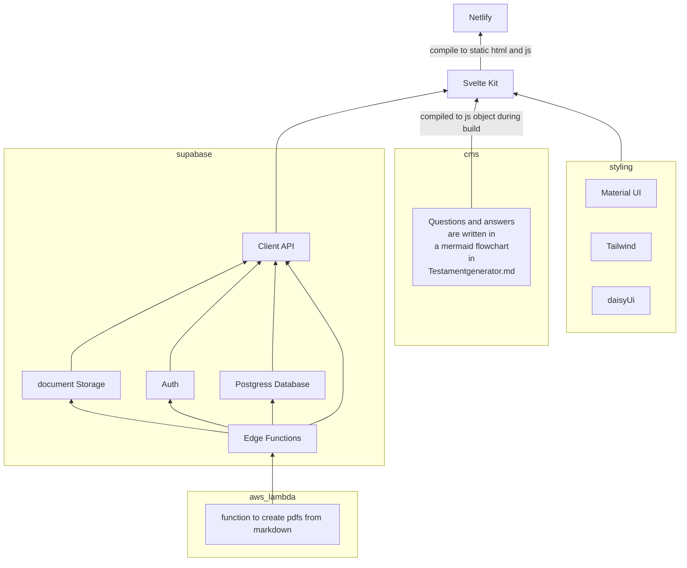
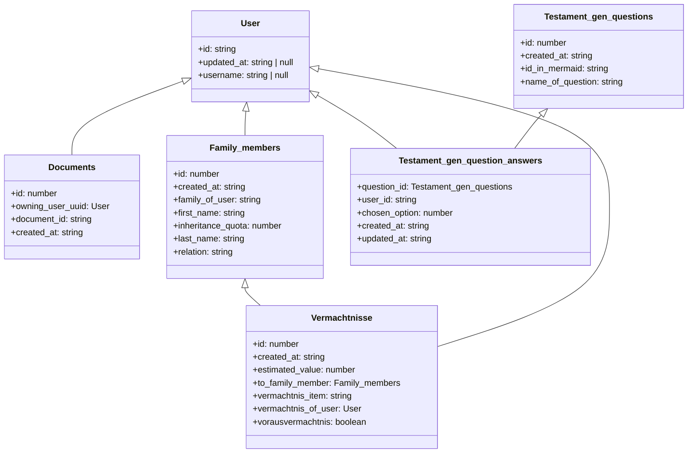

# MeinNachlass.com WebApp
Web app for our MeinNachlass.com Service

## What does this app do?
MeinNachlass.com allows you to take care of your estate yourself. Just as a notary or estate planning advisor would do, we guide you through the process of creating your will in a questionnaire.

Landingpage: [www.MeinNachlass.com](https://www.MeinNachlass.com)   
WebApp: [app.Meinnachlass.com](https://app.Meinnachlass.com)  
[](https://app.netlify.com/sites/service-beyond/deploys)

Screenshot of the app`s questionnaire


## How is it built?

I have solo developed this WebApp including frontend and backend.  
I made the CSS and style of this website according to a proto.io prototype.  
This website is built with svelte-kit and Supabase in a JAM-stack configuration.  
The Sveltekit Frontend is compiled into a static website hosted on Netlify (CDN).  
Supabase is a Backend as a service based on a Postgres DB.  
Supabase is used for all Database stuff, Authentication and Authorisation and as a blob storage for PDFs.  
I use a single aws lambda function for generating PDFs from markdown.  
Check out the infrastructure diagram in the [infrastructure diagram](#infrastructure-diagram).  

Thanks to the simplicity of the architecture and the power of my hosting providers Netlify and Supabase,  
My web app has the full DevOps workflow with continuous deployment built right in. If I create a pull request to main, a staging site is automatically deployed and online available for review.


## One highlight in the code architecture

Another cool thing about this WebApp is how I have done my CMS for storing and configuring the questions
and answers for my questionnaire. My CMS is just a markdown file versioned through this git repository.
[My Markdown file](/app/src/lib/Testamentgenerator_qusetions.md) has one code block with a mermaid tag. 
mermaid is a cool extension, that can render flowcharts and everything. (I have also used this tool to make the architecture graph in this README).
I use the flowchart syntax of mermaid, to represent my questionnaire.
I use my one extra syntax in the comments of the flowchart to encode extra information.
The transitions of the questions are represented in the regular mermaid syntax.  
With the mermaid extension in VsCode, this flowchart is automatically rendered as a graph.
This allows me to edit the flow of my questionnaire in a simple process with quick feedback.  
This looks like the following:


In the file [questionnaire.ts](./app/src/lib/questionnaire.ts), I have created a compiler for this syntax.
It compiles the questions to a javascript object.
The exported function get_questions() returns the questions and transitions for the questionnaire into a questions and transitions array. 
```js
export function get_questions(): {
    questions: questions_dict;
    transitions: transitions_network;
}
```
In the svelte code, these arrays are utilized to dynamically create the questionnaire.
The selected answers are stored in the database.

- [MeinNachlass.com WebApp](#meinnachlasscom-webapp)
  - [What does this app do?](#what-does-this-app-do)
  - [How is it built?](#how-is-it-built)
  - [One highlight in the code architecture](#one-highlight-in-the-code-architecture)
  - [Installation](#installation)
    - [docker + aws cli for development of supabase edge functions and aws lambda functions](#docker--aws-cli-for-development-of-supabase-edge-functions-and-aws-lambda-functions)
    - [VS Code extensions](#vs-code-extensions)
  - [Usage](#usage)
    - [How to do Icons](#how-to-do-icons)
    - [setup supabase](#setup-supabase)
    - [generate typescript types for supabase](#generate-typescript-types-for-supabase)
    - [supabase edge functions](#supabase-edge-functions)
  - [run the Deno: Initialize Workspace Configuration command.](#run-the-deno-initialize-workspace-configuration-command)
      - [usage](#usage-1)
    - [material UI colors](#material-ui-colors)
  - [Architecture](#architecture)
    - [initial architecture idea](#initial-architecture-idea)
    - [infrastructure diagram](#infrastructure-diagram)
  - [Database structure](#database-structure)


## Installation
I use git-lfs for large binary files like images and other media  
install https://git-lfs.github.com/  

install dependencies and run the dev-server for the svelte-kit frontend
```bash
cd app  
npm install  
npx smui-theme template src/theme
npm run prepare
npm run dev -- --open
```
create your theme files with smui-theme > `npx smui-theme template src/theme`  
Whenever you add a new SMUI package, run > `npm run prepare` again to rebuild your CSS file with the new component’s styles included.

### docker + aws cli for development of supabase edge functions and aws lambda functions
I use docker only for my aws lambda function to 
https://docs.aws.amazon.com/cli/latest/userguide/getting-started-install.html

https://docs.docker.com/get-docker/

### VS Code extensions
These extensions are necessary
- German - Code Spell Checker
- HTML CSS Support
- Svelte for VS Code
- Svelte 3 Snippets
- Tailwind CSS IntelliSense
- Markdown Preview Mermaid Support
- Mermaid Markdown Syntax Highlighting
- deno
- github copilot
- Node.js Notebooks (REPL)
- Material Icon Theme


## Usage

### How to do Icons
choose icon from here https://materialdesignicons.com/  
and import it in the script as follows   
`import { mdiMenu } from '@mdi/js';`  
`import { Svg } from '@smui/common/elements';`  
`import { Icon } from '@smui/common';`
and then:
```html
<Icon component={Svg} viewBox="0 0 24 24" width="20px" height="20px">
    <path fill="currentColor" d={mdiMenu} />
</Icon>
```
or download svg from here https://www.svgrepo.com/svg/485460/right-2
### setup supabase
https://supabase.com/docs/guides/cli  

first you may need to install scoop
it is a command line installer for windows
https://scoop.sh/
```sh	
irm get.scoop.sh | iex
```
then install supabase

```
scoop bucket add supabase https://github.com/supabase/scoop-bucket.git
scoop install supabase
``` 
then you have to link your cli to your supabase project
```sh
supabase link --project-ref cpoebtwwvzcrewfytfad --password here-is-your-database-password
```
maybe also login to supabase with your cli token
```sh
supabase login
```

### generate typescript types for supabase
```sh
supabase gen types typescript --linked --schema public > supabase/types/supabase.ts
```
or
```sh
supabase gen types typescript --linked --schema public > app/src/lib/database.types.ts
```
### supabase edge functions
For this to work some stuff needs to be installed and set up:
- Docker  
 https://www.docker.com/products/docker-desktop/
- deno (language server) 
 https://deno.land/#installation
- setup deno extension in vs code  
 run the Deno: Initialize Workspace Configuration command.
- 

#### usage
```sh
supabase functions -h
```
- delete- >      Delete a Function from Supabase  
- deploy ->      Deploy a Function to Supabase  
- new    ->      Create a new Function locally  
- serve  ->      Serve a Function locally  
```sh
supabase start
```

to start the local supabase docker server
### material UI colors
need to be set in src/variables.scss and src/theme/_smui-theme.scss

## Architecture
### initial architecture idea

Actually, for now, we don't need any external data storage notion CMS is replaced by a mermaid flowchart in the markdown file

### infrastructure diagram

if no diagram is shown, please install the mermaid extension for vs code



## Database structure
*if no diagram is shown, please install the mermaid extension for vs code*


