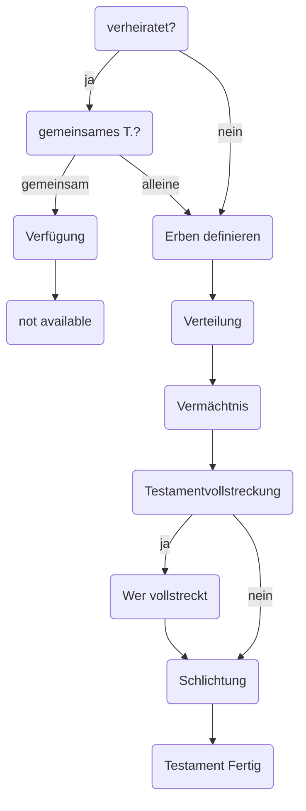

<!-- use alt + z to deactivate word wrap in vs code editor -->

```mermaid
    flowchart TD;
        %%Template
    %%__0xxxx();
        %%frage ''
        %%option0 ''
        %%option1 ''
        %%info ''

    %%States
    __00100(verheiratet?); 
        %%frage 'Wie ist Ihr Familienstand?'
        %%option0 'Verheiratet'
        %%option1 'Nicht (mehr) verheiratet'
        %%info 'Hier ist Ihr offizieller Familienstand maßgeblich. Das bedeutet, dass selbst wenn Sie in fester Partnerschaft leben, nur eine Ehe oder eingetragene Lebenspartnerschaft für Ihr Testament entscheidend sind. (ninebarc)'

    __00110(gemeinsames T.?);
        %%frage 'Wie wollen Sie Ihr Testament erstellen?'
        %%option0 'Mit meinem Ehepartner'
        %%option1 'Alleine'
        %%info 'Wenn Sie verheiratet sind oder in einer eingetragenen Lebenspartnerschaft leben können Sie mit Ihrem Partner ein gemeinschaftliches Testament aufsetzen. Damit bezweckt man vor allem die möglichst umfassende Absicherung des längerlebenden Ehegatten. Dieser wird zunächst Erbe. Die Ehepartner können zudem bestimmen, wer nach dem Tod des längerlebenden Ehepartners ihr Erbe werden soll. Bei einem Einzeltestament hingegen können Sie allein Ihre Erben innerhalb des gesetzlichen Rahmens frei wählen.'
    
    __00200(Erben definieren);

    __00120(Verfügung);
        %%frage 'Wie darf der längerlebende Partner über das Erbe verfügen?'
        %%option0 'Mit gewissen Einschränkungen'
        %%option1 'In vollem Umfang'
        %%info 'Wenn der Längerlebende Partner nach dem Tod des Zuerstversterbenden  vollumfänglich über das Vermögen verfügen kann, wird er als Vollerbe bezeichnet.Das gemeindschaftliche Erbe kann mit einigen Einschränkungen einhergehen. So soll verhindert werden, dass der längerlebende Ehepartner das Erbe komplett ausgeben darf, damit der Nachlass beim Tod des Längerlebenden möglichst ungeschmälert an die Nacherben übergeht." (ninebarc)'

    __00130(not available);
        %%frage 'Diese Option ist bei Beyond aktuell noch nicht verfügbar.'
    __00300(Verteilung);

    __00400(Vermächtnis);

    __00500(Testamentvollstreckung)
        %%frage ''
        %%option0 ''
        %%option1 ''
        %%info ''
    __00510(Wer vollstreckt)
        %%frage ''
        %%option0 ''
        %%option1 ''
        %%info ''
    __00600(Schlichtung)
        %%frage ''
        %%option0 ''
        %%option1 ''
        %%info ''
    __01000(Testament Fertig)


    %%Transitions
    __00100-- ja -->__00110;
    __00100-- nein -->__00200;
    __00110--gemeinsam -->__00120;
    __00110--alleine -->__00200;
    __00120-->__00130;
    __00200-->__00300;
    __00300-->__00400;
    __00400-->__00500;
    __00500--ja-->__00510;
    __00500--nein-->__00600;
    __00510-->__00600;
    __00600-->__01000

```